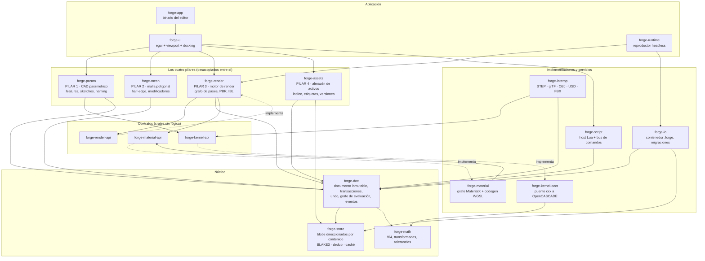

# FORGE — Fase 0: documento de arquitectura

**Versión:** 0.1 · **Fecha:** 2026-08-26 · **Estado:** propuesta para aceptación

Este documento cierra la Fase 0. Contiene: la estrategia de representación dual
(el problema bloqueante), el mapa de módulos, el flujo de datos, el formato de
archivo, el plan de fases con criterios de aceptación, y lo que queda
explícitamente fuera de alcance en v1.

Documentos hermanos: [contratos](01-contratos.md) ·
[alcance y recortes](02-alcance-y-recortes.md) · [dependencias](03-dependencias.md) ·
[ADRs](adr/)

---

## 0. Resumen para quien tenga tres minutos

1. **El problema difícil está resuelto así:** el B-Rep es autoritativo, su teselado
   es caché derivada nunca editable, y el paso al dominio poligonal es un nodo
   explícito y unidireccional del árbol (`ToMesh`) que arrastra un mapa de
   procedencia. Aguas arriba se sigue editando paramétricamente para siempre; aguas
   abajo no se vuelve. Malla → B-Rep no existe en v1, y lo decimos en voz alta.
   → [ADR-0002](adr/0002-representacion-dual.md)

2. **La columna vertebral es un almacén direccionado por contenido.** Undo/redo,
   versiones del documento, caché de evaluación y deduplicación del almacén de
   activos son *el mismo mecanismo*. Eso es lo que hace que "un núcleo compartido"
   sea real y no un eslogan.

3. **Rust para el núcleo, OpenCASCADE tras una interfaz de 40–80 funciones**
   diseñada para poder salir de proceso. wgpu para el render. Lua embebido, Python
   como cliente externo del mismo bus de comandos.

4. **El alcance original es irrealizable para un equipo pequeño** —del orden de
   cientos de años-ingeniero según los referentes históricos. La recomendación es
   recortar hasta *"un CAD paramétrico cuya salida son mallas listas para
   producción, con un almacén de activos serio"*, y dejar fuera escultura, rigging,
   animación y runtime empaquetado. → [alcance y recortes](02-alcance-y-recortes.md)

---

## 1. Modelo de dominios

Toda la arquitectura descansa sobre una distinción: **el dominio exacto** y **el
dominio discreto**.

```
DOMINIO EXACTO                    │  DOMINIO DISCRETO
──────────────────────────────────┼──────────────────────────────────
Sketch 2D con restricciones       │  Malla de medias aristas (half-edge)
Curvas y superficies NURBS        │  Subdivisión Catmull-Clark
Sólidos B-Rep                     │  Pila de modificadores
Cotas exactas, tolerancia 1e-7    │  Posiciones f32/f64, sin tolerancia
Fuente de verdad: el B-Rep        │  Fuente de verdad: la malla
                                  │
       ────────► ToMesh ─────────►│  (puerta de un solo sentido,
                                  │   visible en el árbol de historia)
```

Reglas invariantes del sistema, verificables en tests:

- **I1** — Ninguna operación de usuario escribe sobre un teselado derivado.
- **I2** — El grafo de evaluación es acíclico y su orden topológico nunca hace
  retroceder de dominio discreto a dominio exacto.
- **I3** — Toda entidad geométrica derivada del dominio exacto conserva un
  `StableId` con procedencia.
- **I4** — Toda mutación del documento ocurre dentro de una transacción y produce
  una versión nueva.

Si una funcionalidad exige romper una de estas cuatro, la funcionalidad se rechaza
o se re-diseña. No se rompen los invariantes.

---

## 2. Mapa de módulos



**La regla que hace que esto no se degrade:** ningún pilar depende de otro pilar.
Se comunican por comandos sobre `forge-doc` y por eventos. Un test de CI recorre el
grafo de dependencias de Cargo y falla el build si aparece una arista prohibida.
Sin esa verificación mecánica, la regla dura seis semanas.

### Responsabilidad de cada crate

| Crate | Responsabilidad | No hace |
|---|---|---|
| `forge-math` | Vectores, transformadas, AABB, tolerancias, predicados robustos | Nada específico de dominio |
| `forge-store` | Blobs inmutables por hash, dedup, caché LRU, recolección | Interpretar el contenido de los blobs |
| `forge-doc` | Entidades/componentes, transacciones, undo, grafo de evaluación, referencias, bus de eventos | Conocer qué es un fillet o un shader |
| `forge-kernel-api` | Traits `GeometryKernel`, `SketchSolver`, `Tessellator` | Implementarlos |
| `forge-kernel-occt` | El puente C++ y la traducción de errores | Exponer tipos OCCT hacia arriba |
| `forge-param` | Árbol de features, evaluación, naming persistente, modelo de sketch | Tocar mallas |
| `forge-mesh` | Half-edge, operaciones de edición, pila de modificadores, procedencia | Tocar B-Rep |
| `forge-render` | Grafo de pases, PBR, IBL, sombras, post, selección por GPU | Conocer el árbol de features |
| `forge-material` | Grafo de material MaterialX, generación de WGSL, caché de permutaciones | Ejecutar pases |
| `forge-assets` | Índice SQLite, miniaturas, etiquetas, búsqueda, versiones, dependencias | Ser fuente de verdad (es reconstruible) |
| `forge-io` | Leer/escribir `.forge`, migraciones de versión | Convertir formatos externos |
| `forge-interop` | STEP, glTF, OBJ, USD, FBX | Definir el formato nativo |
| `forge-script` | Host Lua, bus de comandos, servidor IPC para Python | Lógica de pilar |
| `forge-ui` | Viewport, gizmos, paneles, docking | Lógica de pilar |

---

## 3. Flujo de datos: de una cota a un píxel

```
1.  El usuario arrastra la cota "12 mm" → 18 mm en el sketch.
2.  La UI emite  Command::SetDimension { sketch, dim_id, 18.0 }.
3.  forge-doc abre transacción, aplica el cambio, produce la versión N+1
    y marca sucios los nodos del grafo que dependen de esa cota.
4.  El planificador re-evalúa solo el subgrafo sucio, en paralelo (rayon):
      a. forge-param resuelve el sketch (solver de restricciones)
      b. forge-param pide al kernel: extrude, fillet, boolean…
         → forge-kernel-occt, en su pool de hilos dedicado
      c. cada salida se hashea; si el hash coincide con una entrada de
         caché, el subárbol de abajo NO se recalcula
      d. el nodo ToMesh tesela → malla + mapa de procedencia
      e. forge-mesh re-aplica los modificadores; las referencias que no
         re-vinculan se marcan Rotas y se reportan a la UI
5.  Los blobs nuevos se escriben en forge-store (dedup por hash).
6.  forge-render recibe un snapshot inmutable, diffea contra el anterior y
    sube a GPU solo los buffers cuyo hash cambió.
7.  Se dibuja el frame. El documento no se ha bloqueado en ningún momento:
    render y evaluación leen snapshots, solo el hilo de documento escribe.
```

El punto 4c es de donde sale el rendimiento: un cambio de cota que no altera la
geometría resultante (por ejemplo, una restricción redundante) produce hashes
idénticos y no recalcula nada aguas abajo. El punto 7 es de donde sale la fluidez:
no hay bloqueos entre hilos porque no hay estado mutable compartido.

### Modelo de hilos

| Hilo / pool | Qué hace | Restricciones |
|---|---|---|
| **Documento** | Único escritor. Aplica transacciones, publica versiones. | Nunca hace trabajo pesado; delega. |
| **Evaluación** (rayon) | Re-evalúa el grafo sobre snapshots inmutables. | Solo lectura del documento. |
| **Kernel** (pool dedicado) | Llamadas a OpenCASCADE. | Aislado: OCCT no es uniformemente seguro en concurrencia. |
| **Render** | Grafo de pases, submit a GPU. | Lee el último snapshot publicado. |
| **E/S** | Carga/guardado, miniaturas, indexación de assets. | Nunca en el camino del frame. |

---

## 4. Unidades, precisión y tolerancias

Decidido ahora porque cambiarlo después es carísimo:

- **Unidad interna: milímetro. Tipo: `f64`.** La unidad que ve el usuario es
  configurable y solo afecta a presentación y entrada.
- **Tolerancia de confusión del kernel: 1e-7 mm**, coherente con el valor por
  defecto de OpenCASCADE. Consecuencia práctica: modelos por encima de ~1e5 mm
  (100 m) empiezan a estresar la tolerancia relativa y aparecen fallos de
  booleanos. Es una limitación heredada del kernel, no un defecto propio, y hay
  que documentarla en lugar de descubrirla en producción.
- **Tolerancia de teselado**: dos parámetros independientes de la anterior —
  desviación de cuerda (por defecto 0,05 mm o relativa al bounding box, la que sea
  mayor) y desviación angular (15°). Son parámetros del nodo `ToMesh` y del visor,
  no del modelo.
- **Render en `f32` con coordenadas relativas a la cámara** y origen local por
  objeto. Sin esto, una escena grande tiembla visiblemente.

---

## 5. Formato de archivo

Resumen; especificación completa en [ADR-0003](adr/0003-formato-de-archivo.md).

`.forge` es un ZIP con `manifest.json`, el grafo del documento en CBOR (y
opcionalmente en JSON legible), un directorio `blobs/` direccionado por contenido y
un `refs/` con el historial de versiones. La misma disposición sin comprimir es la
forma explotada, apta para control de versiones. Escritura atómica por
temporal+rename. Migraciones dirigidas y versionadas.

Interoperabilidad: **STEP** (leer/escribir, vía OCCT), **glTF 2.0** (leer/escribir,
es el formato de referencia del runtime), **OBJ** (leer/escribir), **USD** (escribir,
subconjunto estático en v1), **FBX** (leer, si hay demanda).

Se documenta en `docs/formato/` con un lector de referencia mínimo en Python que
sirve simultáneamente de ejemplo y de test de la especificación.

---

## 6. Los cuatro pilares, acotados

### Pilar 1 — CAD paramétrico
Sketch 2D con restricciones (coincidencia, paralela, perpendicular, tangente,
horizontal/vertical, distancia, ángulo, radio, igualdad, simetría) resuelto con
PlaneGCS o solver propio; features de extrude, revolve, sweep, loft, fillet,
chamfer, shell, pattern y booleanos vía OpenCASCADE; árbol de historia editable con
supresión, reordenación e inserción; naming persistente por genealogía con
re-vinculación geométrica de respaldo y estado `Rota` visible.

### Pilar 2 — Malla poligonal
Malla de medias aristas con atributos por vértice/esquina; selección y edición de
vértices, aristas y caras; extrude, bevel, loop cut, bridge, knife; subdivisión
Catmull-Clark con creases; pila de modificadores no destructivos (subdiv, mirror,
array, bevel, solidify, weld, decimate); desenvolvimiento UV **automático** vía
xatlas; propagación del mapa de procedencia a través de cada operación.

### Pilar 3 — Motor de render
Grafo de pases explícito; PBR metallic-roughness; IBL con prefiltrado; sombras con
cascadas; post mínimo (ACES, exposición, antialiasing); grafo de materiales con
modelo MaterialX y generador de WGSL propio para un subconjunto acotado;
`forge-runtime` headless que comparte el mismo camino de render.

### Pilar 4 — Almacén de activos
Blobs direccionados por contenido (el mismo `forge-store` del núcleo, de ahí la
deduplicación gratuita); índice SQLite reconstruible con metadatos, etiquetas,
miniaturas y búsqueda; historial de versiones por asset; grafo de dependencias
("qué documentos usan esta textura"); importación por vigilancia de carpetas.

---

## 7. Plan de fases

Cada fase termina con código ejecutable, pruebas y un demo reproducible por
comando. Una fase no se da por cerrada sin los tres.

### Fase 1 — Núcleo, escena, serialización, visor
**Entregable:** `forge-app` abre una ventana, carga un `.forge`, navega la escena
(órbita/pan/zoom), selecciona objetos, deshace y rehace, guarda.
**Contiene:** `forge-math`, `forge-store`, `forge-doc`, `forge-io`, un
`forge-render` mínimo (sin PBR: mate + wireframe), `forge-ui` básica.
**Aceptación:**
- Round-trip guardar/cargar con igualdad estructural sobre 20 documentos generados.
- 10 000 operaciones aleatorias de undo/redo sin divergencia respecto a la
  re-ejecución desde cero (test de propiedad).
- 60 fps con 500 objetos y 5 M de triángulos en hardware de referencia.
- Escritura atómica verificada con inyección de fallo.
- **Demo:** `cargo run --example fase1_visor` — carga una escena de ejemplo,
  navega, deshace.

### Fase 2 — Kernel CAD paramétrico
**Entregable:** sketch con restricciones → extrude/revolve → fillet/chamfer →
booleanos, con árbol de historia editable, y cambio de cota que se propaga.
**Contiene:** `forge-kernel-api`, `forge-kernel-occt`, `forge-param`, STEP in/out.
**Aceptación:**
- **Suite de regresión topológica**: ≥30 casos que editan un parámetro aguas arriba
  y verifican que las referencias aguas abajo siguen apuntando a la entidad
  correcta. Este es el test que decide si el proyecto es viable.
- Round-trip STEP de 50 modelos de referencia sin pérdida de topología.
- Solver de sketch: detección correcta de sub/sobre-restricción en 40 casos.
- **Demo:** `cargo run --example fase2_soporte` — genera una pieza en L con
  agujeros y redondeos, cambia una cota, re-evalúa, exporta STEP.

### Fase 3 — Edición poligonal y la frontera de dominio
**Entregable:** el nodo `ToMesh` funcionando de verdad, con procedencia y
re-vinculación; edición de malla y pila de modificadores.
**Contiene:** `forge-mesh`, integración con el árbol de features.
**Aceptación:**
- **≥95% de referencias re-vinculadas** tras un cambio de cota típico en el
  conjunto de modelos de prueba; el resto marcado `Rota`, nunca re-vinculado mal.
- Invariantes I1–I4 verificados por test.
- Los modificadores propagan procedencia (test por modificador).
- **Demo:** `cargo run --example fase3_cruce` — pieza CAD → `ToMesh` → bevel y
  subdivisión → cambio de cota aguas arriba → el trabajo poligonal sobrevive.

### Fase 4 — Render y materiales
**Entregable:** PBR, IBL, sombras, post, grafo de materiales por nodos con
generación de WGSL; `forge-runtime` headless.
**Aceptación:**
- Comparación con referencia sobre la suite de glTF-Sample-Assets, dentro de
  tolerancia perceptual.
- Editor y runtime producen píxeles idénticos para la misma escena.
- Compilación de shaders sin bloquear el frame (perezosa, cacheada).
- **Demo:** `cargo run --example fase4_render` — escena PBR con IBL, luego el mismo
  archivo renderizado por `forge-runtime` sin editor.

### Fase 5 — Almacén de activos
**Entregable:** biblioteca local versionada con metadatos, etiquetas, búsqueda,
miniaturas, dedup e historial.
**Aceptación:**
- Dedup verificado: importar el mismo asset por dos rutas produce un solo blob.
- El índice se reconstruye por completo desde los blobs tras borrarlo.
- Búsqueda por debajo de 100 ms sobre 100 000 assets.
- **Demo:** `cargo run --example fase5_biblioteca` — importa una carpeta, etiqueta,
  busca, revierte un asset a una versión anterior y ve el documento actualizarse.

---

## 8. Fuera de alcance en v1 — explícito

Esto no es una lista de deseos pendientes: es un compromiso de no construirlo,
para que el núcleo salga excelente. Justificación en
[`02-alcance-y-recortes.md`](02-alcance-y-recortes.md).

- **Escultura** (multiresolución, dyntopo, motor de brochas).
- **Rigging, skinning y animación por keyframes.**
- **Desenvolvimiento UV interactivo** con costuras y edición en el espacio UV.
  (Sí hay unwrap automático vía xatlas.)
- **Runtime empaquetado como aplicación autónoma** por plataforma. (Sí hay
  `forge-runtime` headless que prueba el camino de datos.)
- **Malla → B-Rep** en cualquier forma no trivial: ajuste de superficies,
  reconocimiento de features, reingeniería de escaneos.
- **SubD como tercer dominio con vuelta a NURBS.**
- **USD completo**: composición, capas, variantes, referencias, payloads.
- **Superficies NURBS como disciplina de autoría** (parcheado, continuidad G2,
  herramientas de superficie clase A).
- **Ensamblajes** con relaciones de posición, y **planos 2D** acotados, GD&T,
  lista de materiales.
- **Simulación** de cualquier tipo.
- **Nodos de geometría procedural.**
- **Colaboración multiusuario y edición concurrente.**
- **Plugins nativos cargados dinámicamente.** (Sí hay bus de comandos y Lua.)
- **Ray tracing / path tracing.**

---

## 9. Riesgos principales

| # | Riesgo | Impacto | Mitigación | Señal de alarma temprana |
|---|---|---|---|---|
| R1 | El naming persistente no aguanta y las referencias se rompen a menudo | **Fatal.** Es el fallo que hunde los CAD paramétricos. | Suite de regresión topológica desde la Fase 2; estado `Rota` visible; nunca re-vincular en silencio | <90% de re-vinculación al final de la Fase 2 |
| R2 | El puente a OCCT resulta más caro de lo previsto | Alto: retrasa la Fase 2 entera | Interfaz de 40–80 funciones, no la API completa; prototipo del puente **antes** de cerrar la Fase 0 | El prototipo de puente supera 3 semanas |
| R3 | El alcance no se recorta y salen cuatro mitades | **Fatal para el producto**, no para la técnica | Fuera-de-alcance escrito y aceptado; revisión de alcance al cierre de cada fase | Aparece "y ya que estamos…" en las tareas de una fase |
| R4 | Rendimiento del render con documentos grandes | Medio | Diff por hash y subida incremental a GPU desde la Fase 1; presupuesto de frame medido continuamente | La Fase 1 no llega a 60 fps con 5 M de triángulos |
| R5 | MaterialX no cubre WGSL y el generador propio crece sin control | Medio | Lista cerrada y pública de nodos soportados; subconjunto acotado | La lista de nodos crece sin que se cierre ninguna función |
| R6 | Licencias incompatibles con el modelo de negocio | Alto y tardío | Auditoría de licencias en la Fase 0, antes de escribir código; ver [`03-dependencias.md`](03-dependencias.md#5-licencias) | Aparece una dependencia GPL en el árbol |
| R7 | Las estructuras persistentes son demasiado lentas para mallas | Medio | Mallas como blobs opacos fuera del árbol; sellado de versión al soltar el ratón | Latencia perceptible al arrastrar vértices en la Fase 3 |

---

## 10. Qué hace falta antes de empezar la Fase 1

Tres cosas, y son baratas comparadas con lo que evitan:

1. **Prototipo desechable del puente OCCT** (~1 semana): compilar OCCT en las tres
   plataformas, exponer `extrude` y `boolean` por `cxx`, obtener un teselado en
   Rust. Sirve para calibrar R2 antes de comprometerse.
2. **Auditoría de licencias** de OpenCASCADE, PlaneGCS, OpenSubdiv, MaterialX,
   xatlas y ufbx, contrastada con el modelo de distribución previsto.
3. **Aceptación explícita del recorte de alcance** de la sección 8. Si no se acepta,
   el resto de este documento describe un proyecto distinto y hay que rehacer los
   plazos.
